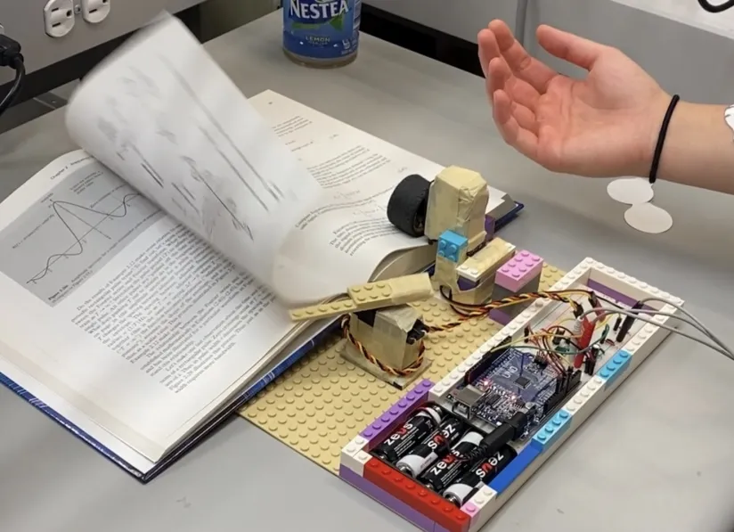
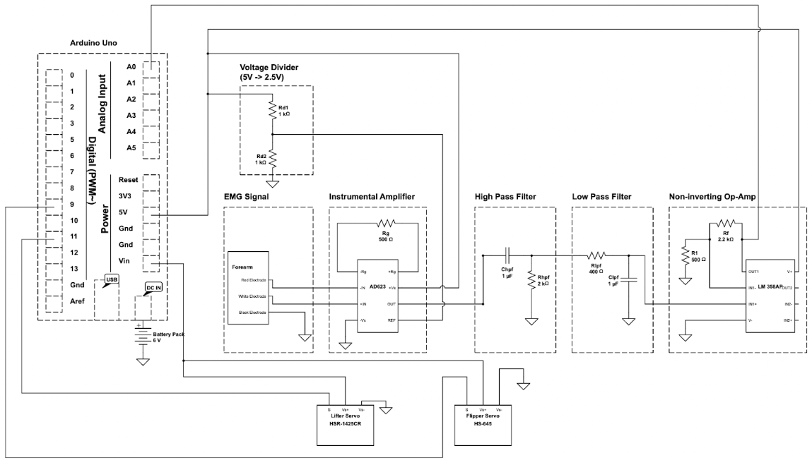

# EMG Page Turner

Flipping the pages of a textbook is a fine-motor task that may be challenging for hand amputees and non-amputees alike.
This automated page turner measures forearm contractions using electromyography (EMG) to trigger a page turn.
It makes use of an Arduino Uno microcontroller, two Servo motors, and a number of filtering and amplification methods to
ensure the device functions accurately and efficiently.

The design and development of this prototype was completed my me and my partner, Gloria So, as a joint project between
*BME 261: Prototyping, Simulation, and Design* and *BME 294L: Circuits, Instrumentation, and Measurements Laboratory*.

### Video demonstration:

### Schematic:

